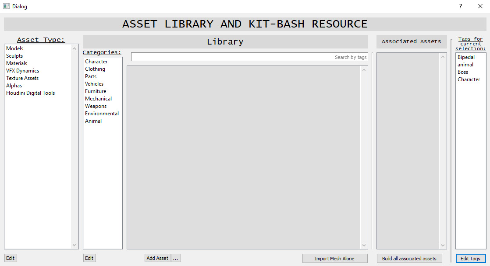

# A pythonic asset manager and kitbashing library written for Autodesk Maya 2018.

A tool for managing rig and animation assets, and baking animations back onto rigs.

## Prerequisites:

* PyQt5
* Autodesk Maya 2018

## Built with:

* PyQt5
* Maya.cmds
* Maya.mel

## Main UI window wireframe:

    A UI wireframe I created in QtDesigner

## How to use:

* After Launching the manager the user should be able to add an asset and its connected assets to the library and add tags to each of the assets.
* The user will be able to search assets by asset type, and then categories or by searching by tags.
* Then add the asset to the scene either as the base asset or the asset with all its associated assets build and connected to it.
    